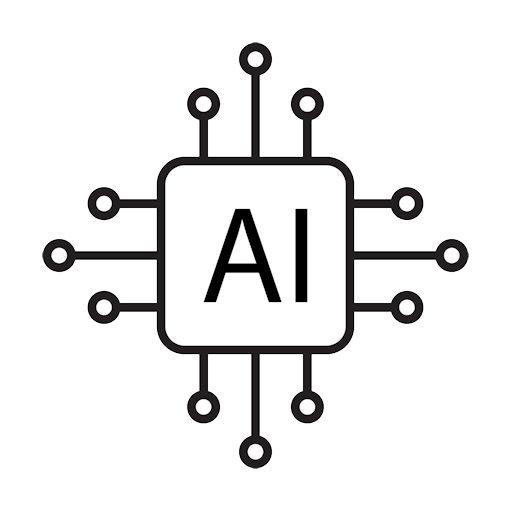

  

 
# AIEngine

Introducing AIEngine: Empowering Your Applications with AI Capabilities

AIEngine is an advanced AI framework meticulously crafted in Delphi, designed to seamlessly integrate into any programming language capable of importing from a DLL. This cutting-edge framework empowers developers to harness the power of artificial intelligence and infuse it into their applications effortlessly. 

Our initial release of AIEngine is fully optimized for the Win64 platform, ensuring a robust and stable foundation for your AI endeavors. Rest assured, we are dedicated to continuous improvement, with other platforms already under consideration for future versions.

Key Features:

1. Intuitive SDK with a Straightforward API: AIEngine offers an intuitive software development kit (SDK) that comes equipped with a user-friendly API. This streamlined interface simplifies the integration of AI functionalities into your application, minimizing complexities and saving valuable development time.

2. Enhance Your Applications with AI: Unleash the true potential of your applications by incorporating AI capabilities with ease. AIEngine opens up a world of possibilities, enabling your software to handle complex tasks, improve user experiences, and deliver unprecedented performance.

3. Low-Cost Access to Leading AI Models: At AIEngine, we understand the importance of leveraging state-of-the-art AI models to drive innovation. As part of our service offering, we provide affordable access to cutting-edge AI models, including OpenAI's GPT modals, enabling your applications to utilize the most advanced AI technologies without breaking the bank.

4. Extensible and Future-Ready: We have designed AIEngine with a strong emphasis on extensibility and future-readiness. As AI technologies continue to evolve, rest assured that AIEngine will adapt seamlessly, enabling you to stay at the forefront of innovation without having to reinvent your AI infrastructure.

5. Dedicated Support and Resources: Our commitment to our users extends beyond the software itself. We provide comprehensive support and a wealth of resources, including documentation, tutorials, and forums, to assist you in making the most of AIEngine's capabilities.

With AIEngine, you can revolutionize your applications, unlocking new possibilities and providing enhanced experiences for your users. Whether you are a seasoned AI developer or just embarking on your AI journey, AIEngine is here to empower you every step of the way.

Welcome to the future of AI-infused applications. Welcome to AIEngine.

*NOTE: This product is active development, stay tuned to this repo and join our discord for more information and updates on this project, availability etc.*

### Support
- <a href="https://github.com/tinyBigGAMES/AIEngine/issues" target="_blank">Issues</a>
- <a href="https://github.com/tinyBigGAMES/AIEngine/discussions" target="_blank">Discussions</a>
- <a href="https://tinybiggames.com/" target="_blank">tinyBigGAMES Homepage</a>

<h5 align="center">

:heart: Built in Delphi
</h5>